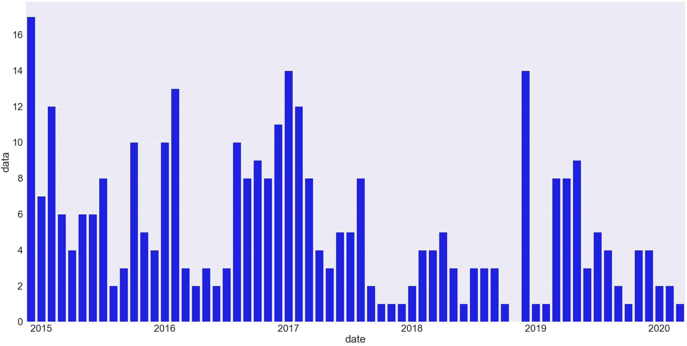
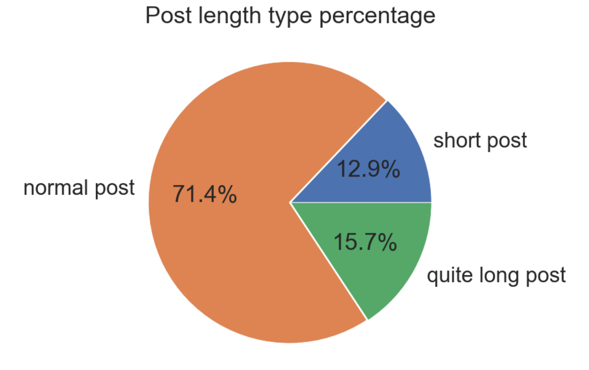

# Facebook posts analysis

### Data extraction from Facebook personal stats and visualization charts to see the transformations made in the json file.

1. You can extract files from Facebook, depending on how much you use the social network, it will take more or less time to receive the json or html file. You can see a lot of information so I recommend selecting only what you want when requesting the info. In this case, I want to see how was my travel page performance.
2. I used pandas library to convert json into a dataframe.
3. There are some columns with no interest, I will drop them to keep only what is important for this analysis.
4. Date is important, we need it in the right format.
5. As I will group number of posts per month, a counter will help.
6. Finally, a bar plot will show how was my activity during the years since I created this page.

Now it comes a more interesting analysis. Facebook will supply a full but tricky json file, where we will have to convert and play with the data types and avoid nulls and nans to find the solution.
I wanted to go through al the nested dictionaries and find which posts were suuuuper long and which ones short.

